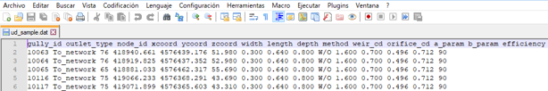

# 9. Export - Import of the hydraulic model

## 9.1 Process characteristics

The export-import process to a hydraulic model has changed compared to previous versions of Giswater, since now the plugin integrates all the functionality. Let us look at some added improvements:

1. The elements can be sent to a model according to their status (STATE) that can be on service, obsolete or plannified, with the only condition that they have hydraulic coherence. For example, if in a sector I only have one tank in service state, and I send only the planned elements to a hydraulic model, this will not be possible.

2. In case of WS projects it is possible to configure the roughness according to the age of the pipe. To do so, use the inp_cat_roughness table and assign the age to the element. If the construction date is not assigned to the element, it will be considered new for the purpose of capturing the roughness value.

3. Some new elements appear which we have named nodarcs. The nodarcs are those elements that in inventory management are flow regulating nodes, such as valves or pumps, but that in the hydraulic model must be arcs, since a flow regulator in a conceptual way is always an element 'arc' that regulates flow between two different nodes.

The basic concepts that govern the export of the network to the hydraulic model, as well as the export peculiarities of each of the elements of the network, and the range of options allowed by the tool, are described at GitWiki:

!!! note "[epa_basics · Giswater/giswater_dbmodel Wiki](https://github.com/Giswater/giswater_dbmodel/wiki/epa_basics)"

### 9.1.1 Main characteristics for water supply networks (WS)

To perform the hydraulic model, it’s necessary to have complete and accurate data for each of the elements and parameters that you want to model, therefore, to understand everything required in each of the hydraulic model tables, we will have the EPANET manual, which specifies in a very exact and detailed way all those necessary concepts.

#### 9.1.1.1 Working by sectors
The work by sectors allows the user to filter and send to the hydraulic model only those elements that belong to a specific sector or send several sectors at the same time. As specified in section *4.2.1.2* of this manual, the field 'sector_id' stores the data of the hydraulic sector to which the element belongs, and subsequently through the table ‘selector_sector’ filters those elements that belong to the selected sectors.

It should be noted that the sectors selected for export to the hydraulic model must have hydraulic coherence, i.e., for WS there must be a water reserve, which supplies the system (RESERVOIR, TANK) and at least one point of consumption.

To select sectors to send to the hydraulic model, we use the basic 'Selector' tool.

|  |
|:------------------------------------------------------------------:|
| *From the Go 2 EPA tool form you can manage the different options*|

#### 9.1.1.2 Demand scenarios

In the case of WS networks, the demand scenarios appear. The demand scenarios allow the user to define different demand hypotheses on consumer items (JUNCTION).

In a normal case, the relation between point of consumption and value of demand is 1:1 and the main value of demand 'demand', together with consumption pattern *'pattern_id'* are defined in table *'inp_junction'*, as shown in the following image.

Through the *'inp_demand'* table, the user can apply an alternative demand to the main demand of the consumption node and in turn change the demand pattern. To do this, first the new scenario is created in the catalog table *‘cat_dscenario’* and then the node element is linked with the new demand and the scenario to which it belongs, as shown below.

#### 9.1.1.3 Transformation of nodes into arcs

Giswater solves this duality using the elements called *'nodarc'*, elements that by their characteristics in the inventory are nodes, but due to their behavior of flow regulator in the hydraulic model must be arcs. This *'nodarc'* element is defined by the user’s demand in the system table (*node_type*).

All those elements that are labeled as SHORTPIPE / VALVE / PUMP, are *'nodarc'* type elements, and therefore their model information is stored in the tables:

- inp_shortpipe
- inp_valve
- inp_pump

For a 'nodarc' element to be valid, it must comply with the rule of having 1 or 2 extreme arcs, otherwise the node will not be valid and will not become an arc.

The transformation process from NODE to ARC is the following:

* A new ARC type geometry of 0.5 meters length or less is generated (suffix _n2a).
* Two new JUNCTION nodes are generated (suffixes n2a1 'initial node' and n2a2 'final node').
* The arc geometries of the existing arcs are 'clipped' and reconnected to the new nodes to accommodate the new arc.
* The attributes of the JUNCTION elements are inherited from the parent node.
* The attributes of the ARC elements are inherited from one of the two extreme arcs (material, diameter, etc.).

#### 9.1.1.4 Possibility of multipump

When representing a pumping within Giswater, it is possible that the relationship between the element and its behavior in the hydraulic model is not 1:1, i.e., (a pumping element is equivalent to a pump-type flow regulator), but rather contains more than one pump and therefore a 1:n relationship is generated with the element, (a pumping-type cadastre element is equivalent to several flow regulators).

Every flow regulator labeled as PUMP stores its information in the 'inp_pump' table, which must be completed with the parameters that regulate the operation of said pump, thus, by default the relationship that is generated between the node and the number of pumps is 1:1.

Through the *‘inp_pump_additional’* table, Giswater allows the user to manage more than one pump for a single pump-type element. This table must indicate the id of the parent node, the number of the pump defined in that node with respect to the total number of additional pumps and the working parameters of each of the additional pumps, as shown in the following example:

The example shows two additional pumps of the node '1105', i.e., this node, when exported to the hydraulic model, will be transformed into three pump-type arcs each with their own working parameters.

#### 9.1.1.5 Different simulation options

|  |
|:------------------------------------------------------------------:|
| *All possible export options*|

|  |
|:------------------------------------------------------------------:|
| *How the most important options are combined: NETWORK GEOMETRY GENERATOR, DEMAND TYPE & PATTERN METHOD*|

The relationship established between them is complex and is detailed in this table:

[go2epa_methods.pdf](https://github.com/Giswater/docs/blob/master/github/pdf/go2epa_methods.pdf)

On the other hand, regarding the management of the status of the valves of a supply network is usually somewhat dynamic, depending on the user's needs, the status of the valves may be one or the other to perform the hydraulic simulation of the model. This modification of the status of the valves is due either to changes made in the inventory (broken valve, valve out of service, etc.) or to specific changes in their status when generating a cutting polygon.

Thus, it can be said that the valves may have different status depending on the table in which the data is stored: *'inp_shortpipe'*, *'man_valve'* or *'anl_result_mincut_valve'*.

Through the "Options" button within the export form to the hydraulic model, the user will be able to choose the status of the valves to be used in said simulation.

- **EPA TABLE**: Those whose status is ‘In service’ or ‘Planned’ in the ‘inp_shortpipe’ layer.
- **INVENTORY VALUES**: Those whose status is ‘In service’ or ‘Planned’ in the ‘man_valve’ layer.
- **MINCUT RESULT**: Those valves that, depending on the results generated by the cutting polygon, have been affected. In turn, the user will be able to choose through the "Mincut result id" drop-down, the results of the cutting polygon that he wishes to model.

### 9.1.2 Main characteristics for urban drainage networks (UD)

To perform the hydraulic model, it is necessary to have complete and accurate data for each of the elements and parameters we wish to model; therefore, to understand everything required in each of the hydraulic model tables, the SWMM manual is available, which specifies in a very exact and detailed way all those necessary concepts.

#### 9.1.2.1 Working by sectors

The work by sectors allows the user to filter and send to the hydraulic model only those elements that belong to a specific sector or send several sectors at the same time. As specified in section **4.2.1.2** of this manual, the field *'sector_id'* stores the data of the hydraulic sector to which the element belongs, and subsequently through the table *'selector_sector'* it filters those elements belonging to the selected sectors.

It should be noted that the sector or sectors selected for export to the hydraulic model must have hydraulic coherence, i.e., for UD networks the minimum requirements would be an entry point of water into the system, either rain, through the application of a rain in the SUBCATCHMENTS or, through wastewater (DWF), and an exit point of the system (OUTFALL).

#### 9.1.2.2 Management of hydrology scenarios

In case of UD networks, exists the hydrology scenarios. The hydrology scenarios allow the user to define different hypotheses about the method of infiltration, surface runoff, groundwater, de-icing, etc. applied to the drainage sub-basins (SUBCATCHMENTS).

Using the catalog *'cat_hydrology'* it is possible to define a catalog element referring to the data of water flows that enter naturally into the system, indicating the identifier, a name, and the used infiltration method.

The infiltration methods recognizable by SWMM are: *curve number*, *Green-Ampt* or *Horton equation*.

Once the hydrology catalog has been defined, in the *inp_subcatchment* table each drainage sub-basin is related to the hydrology catalog to which it belongs, through the *hydrology_id* field.

This relationship allows us to apply different calculation hypotheses on the same drainage sub-basin, and with the hydrology selector select those that we wish to use for the simulation.

It is important to note that the fields filled in that refer to the infiltration method in the inp_subcatchment table must be recognizable by the hydrology catalog that is assigned to them.

#### 9.1.2.3 Integration of the standard form catalog of SWMM

Giswater integrates into its system the different varieties of geometric sections that SWMM supports to catalog the ducts of a UD network. Through the arcs catalog table, the different types of ducts are defined, filling in the following mandatory fields: *id, matcat_id, shape and the geom* fields necessary to define the shape.

To know what data to put in these fields, you should consult the SWMM section catalog and know how this catalog and the domain table of normalized section values ​​(cat_arc_shape) work in an integrated way.

In this sense, the cat_arc_shape table is composed of the following fields:

* **Id**: name of the shape (in selected language) of our catalog (is the one that acts as domain values of the cat_arc_shape field).
* **Epa**: name that receives the shape in SWMM (see section catalog of SWMM).
* **tsect_id**: in case of open irregular shapes, label of the set of values in the inp_transects table that define the irregular geometry according to the HEC format.
* **curve_id**: in case of shapes not included in the catalog of the attached document, the name of the curve defined in the inp_curve table defines the pairs of values that make up the detail of the shape of this section.
* **image**: system field with the name of the png file that is stored in the Giswater plugin folder (plugins/giswater/png) and that is called when an info is done on an arc type element and the cost tab is clicked.
* **descript**: auxiliary field of the description of the section.
* **active**: boolean field that allows to control if the form is active in our catalog or has been unsubscribed and is not selectable.

Considering the previous information and consulting the SWMM section catalog, the geom* fields can be filled in depending on the chosen shape.

Here are two examples of the relationship between the *cat_arc_shape* table and the cat_arc arc catalog.

If you wanted to catalog circular ducts, for example, as ' Redondo ' this translates to:

**For the cat_arc_shape table**,

 cat_arc_shape.id = 'Redondo'

 cat_arc_shape.epa = 'CIRCULAR'    

 cat_arc_shape.image = 'ud_section_circular.png'

And in the cat_arc table,

 cat_arc.shape = 'Redondo'

 cat_arc.geom1 = The value expressed in meters of internal diameter of the element

If I wanted to catalog my closed rectangular ducts, for example, as 'Rectangular' this translates to:

**For the cat_arc_shape table**,

 cat_arc_shape.id = 'Rectangular'

 cat_arc_shape.epa = 'RECT_CLOSED'    

 cat_arc_shape.image = 'ud_section_rect_closed.png'

**And in the cat_arc table**,

 cat_arc.shape = 'Rectangular'

cat_arc.geom1 = The value expressed in meters of the interior vertical dimension of the element

cat_arc.geom2 = The value expressed in meters of the interior horizontal dimension of the element

In reality, the table cat_arc_shape is already filled in with all the standardized forms of SWMM, so expanding this catalog according to our needs is quite easy to understand and proceed.

THREE BASIC RULES are always fulfilled:

1) The value of cat_arc_shape.id can be customized by the user, but the value of cat_arc_shape.epa **must always be normalized** to one of the values of the SWMM section catalog.

2) All the measurements (cat_arc.geom*) **are interior** and should be expressed in **meters**.

3) The values of cat_arc.geom1 always correspond to the vertical dimension of the element, as well as the values of cat_arc.geom2 always correspond to the horizontal dimension of the element.

For the other cases, consult the SWMM section catalog.

|  |
|:------------------------------------------------------------------:|
| *Table with the different SWMM sections that Giswater incorporates as a method to inventory the shape of the ducts.*|

#### 9.1.2.4 Flow regulators

For the management of the different flow regulators, the version 3.0 of Giswater maintains the same logic as the previous versions where the virtual arcs can be assigned to an EPA element.

In this sense, there are two types of virtual arcs, those that enter the node (which would be the extension of the driving that precedes it) and those that leave the node (which would be the flow regulator).

In the first case, the **virtual** arc is simply a flow propagator, which apart from the characteristics of the element, must indicate the direction it drains (the node 2). Therefore, when carrying out the export to the hydraulic model, what Giswater does is joining this virtual arc with its predecessor, converting the two into one.

At the same time, if the *add_length* field we have it as *true*, the length of the virtual arc will be added at the time of merging, but if we have it in *false*, the length of that element will not be added.

In a practical case, the virtual arcs which are flow propagators, would be applied to nodes of big dimensions like deposits or cameras, whose arcs arrive to them but do not connect with the center but remain at its perimeter, and the connection section between these two points would be a **virtual_arc**.

In the second case, the **virtual** arc behaves as a flow regulator. The flow regulators are structures or devices used to control and derive the flows within the transportation system. The flow control elements that SWMM can model are the ones listed below, and its information is stored in the following tables:

* Orifice, table: inp_flwreg_orifice
* Weirs, table: inp_flwreg_weir
* Outlets, table: inp_flwreg_outlet
* Pump, table: inp_flwreg_pump

In the tables named above, when introducing a new flow regulator, the following parameters must be defined: source node, destination arc, regulation ordinal (in case we want to introduce more than one regulator between that node and that arc with that type of regulation), and finally the different parameters that control said regulator.

In the case if there is a virtual arc just after the node, the *exit_conduit* field should not be the arc_id of the virtual arc but should be the arc_id of the conduit that receives the flow since the merge operation of the virtual arcs with the conduit this is coupled with the arc_id of the conduit.

If more than one regulator coexists between a given node and arc, at the time of export, the system draws as many arcs for SWMM as there are regulators.

Important aspects to consider with the flw_length parameter:

* The parameter flw_length is the length of the flow regulator.
* If there is more than one flow regulator between the node and arc, the system will take the maximum value.
* The length of the flow regulator is important in case of orifices or weirs and refers to the distance downstream of it, in which normal flow conditions in the pipeline can not be assumed, i.e., this is an ineffective length of the downstream conduit.

## 9.2 Export methods

Until version 3.5.025, for "ud" projects, when we wanted to export our network we had to go to "Go to EPA" and click on "Options" to configure a series of parameters (both in the "Inp" and in the "Rpt" tab) that were necessary for the simulation.

Since version 3.5.026, in the "Inp" tab, in the "GENERAL" section, we find the "Network geometry generator" parameter, which will allow us to configure the export to perform the simulation with SWMM (option "1D SWMM") or with IBER (option "1D/2D SWMM-IBER").

|  |
|:------------------------------------------------------------------:|
| *Network geometry generator parameter.*|

This opens up a wide range of possibilities when studying our network, since it allows us to also simulate it with IBER and study its behaviour in the different scenarios that can occur in floods.

NOTE: IBER is a two-dimensional hydraulic model software used for simulation of free overland flow. For more information, you can visit their website: [https://www.iberaula.es/](https://www.iberaula.es/).

When we choose the option "1D SWMM" an inp file will be generated, as before, containing all the information that SWMM needs to ru the simulation. In the event that we choose the "1D/2D SWMM-IBER" option, two files will be generated that can be loaded into IBER:

* One with the .inp extension that will only use the hydraulic data (data referring to rainfall or hydrology will not be used since they must be created specifically in IBER).
* Ahother with a .dat extension that will contain the information on the drains that will be managed from IBER.

|  |
|:------------------------------------------------------------------:|
| *Example of a .dat file created on export.*|

As we can see in the previous image, in the new .dat file we have some fields from the sink layer that did not exist until now.

Next, we will see what they are.

### 9.2.1 Gullys layer management
As of version 3.5.026, if we display the "EPA" group in the ToC, within the "Hydraulics" subgroup we can see that we have three new layers:

* Inp Netgully: represents those gullys that function as a node.
* Inp Gully: are the gullys of the network.
* Gully2Node: line that joins the drain to the node.

Since the layer we are interested in is the "Inp Gully", we are going to focus on it. If we open its attribute table and scroll to the end, we will see that there are some fields that we must fill in:

|  |
|:------------------------------------------------------------------:|
| *Inp Gully layer attribute layer.*|

* outlet type: outlet type. We may have two options:
    * To_network: towards the network.
    * Sink: the flow will be lost as sink behaviour.
* custom top elev: custom elevation. This value overrides the value of the top_elev field.
* custom width: custom width. This value overrides the width that the inlet is assigned in its corresponding catalog.
* custom length: custom length. This value overrides the length that the gully is assigned in its corresponding catalog.
* custom depth: custom depth. This value overrides the depth that is defined in the node or gully depth.
* method: calculation method used for gullys in IBER. There are two options:
    * W/O: this method uses the values of the "weir_cd" and "orifice_cd" fields.
    * UPC: this method uses the values of the "a_param" and "b_param" fields. For more information about this method, you can visit [https://upcommons.upc.edu/handle/2117/172466](https://upcommons.upc.edu/handle/2117/172466).
* weir_cd: discharge coefficient of the weir used in the W/O method.
* orifice_cd: discharge coefficient of the orifice used in the W/O method.
* custom_a_param: custom value for the A parameter when using the UPC method. This value overrides the parameter value in the corresponding catalog.
* custom_b_param: custom value for the B parameter when using the UPC method. This value overrides the parameter value in the corresponding catalog.
* efficiency: efficiency of the sump in controlling runoff.

We can configure the values of the "outlet type", "method", "weir_cd", "orifice_cd" and "efficiency" fields by default by going to the "Basic" tab in the Giswater configuration.

|  |
|:------------------------------------------------------------------:|
| *Default configuration of Epa variables.*|

When we have filled in all the corresponding values, we can now export our network. As soon as we have exported it, we will have to be aware of possible critical errors that may occur. In the event that any appear, we must correct them.

|  |
|:------------------------------------------------------------------:|
| *Default configuration of Epa variables.*|

Example of critical error to correct after export.